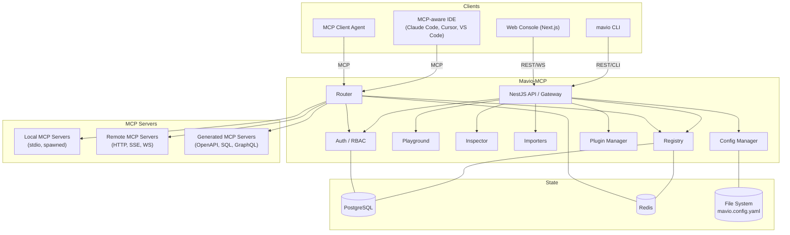
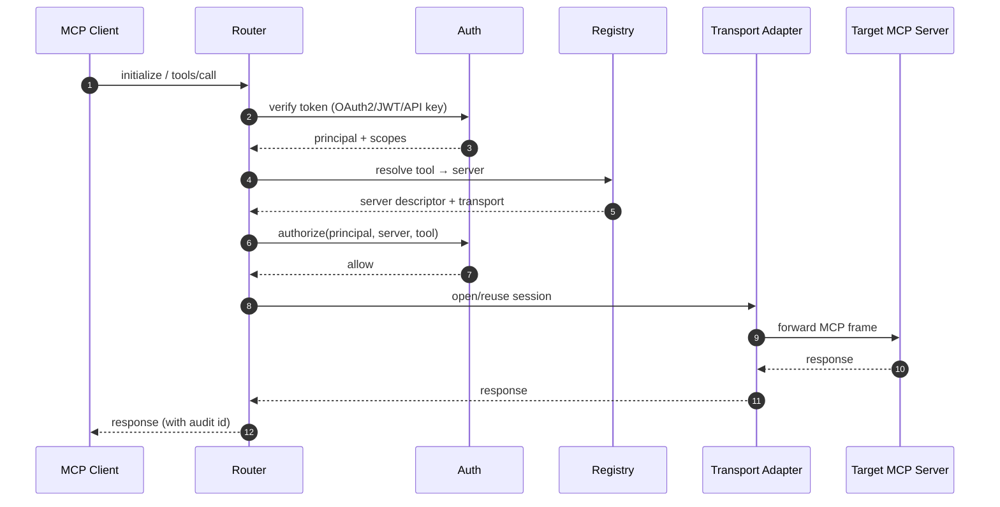
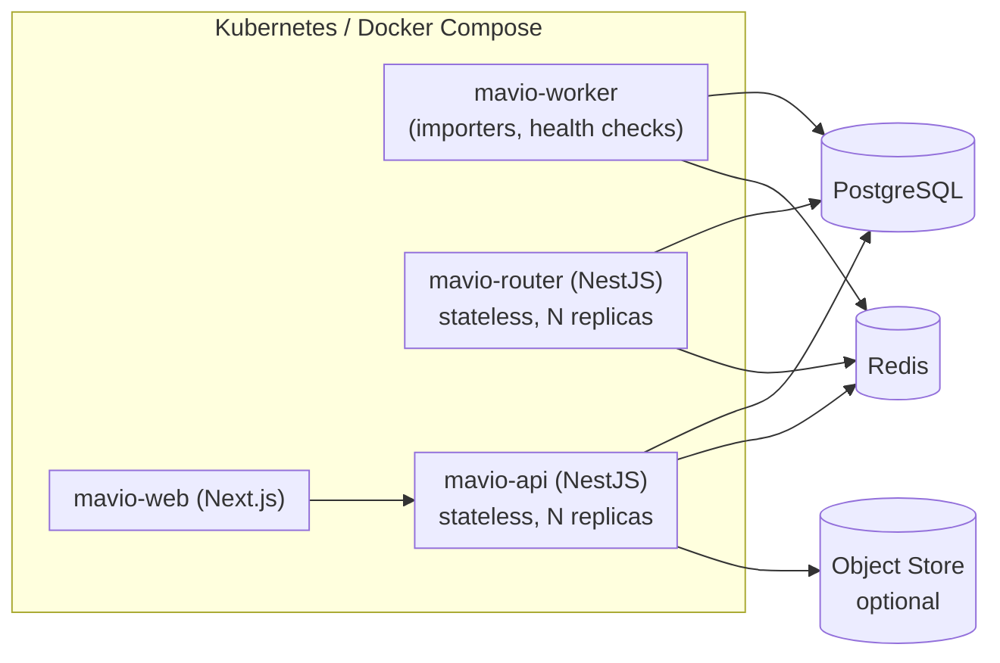
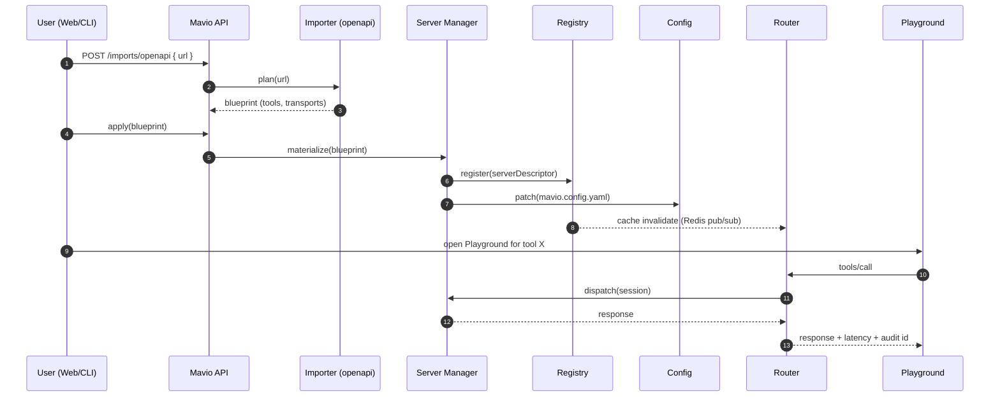
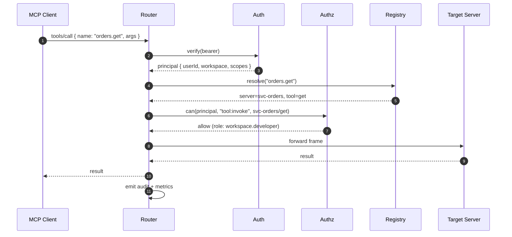
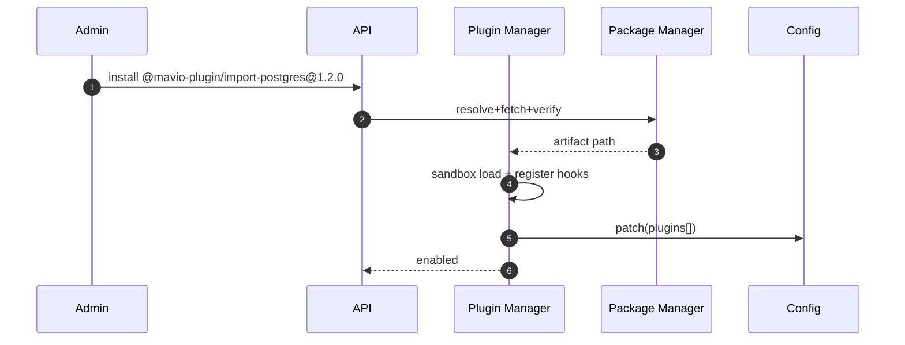
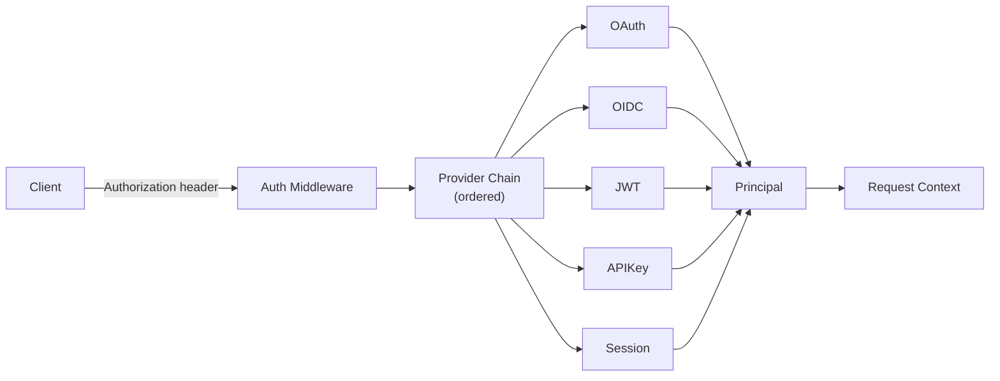
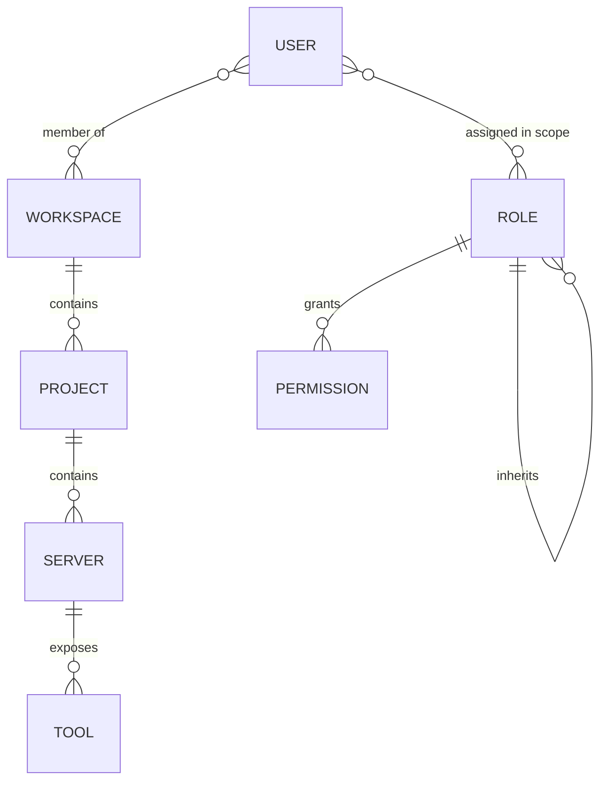
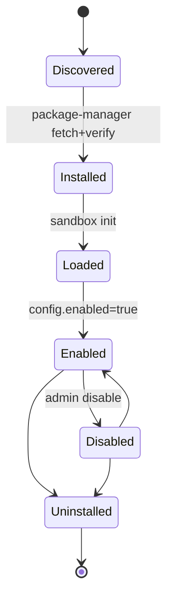
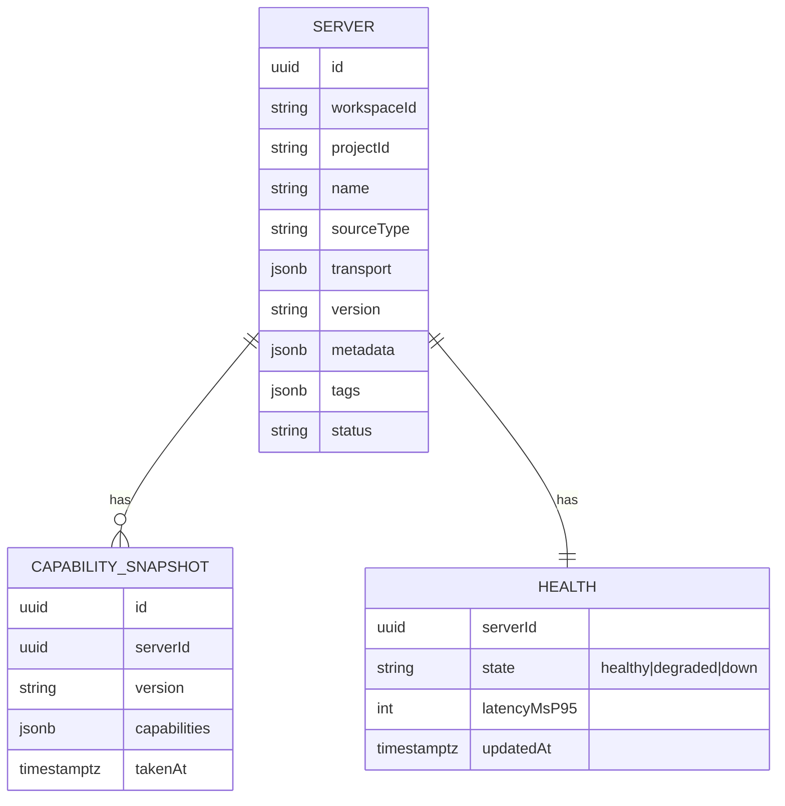

# Mavio-MCP — Architecture Design Document

**Status:** Draft v1.0
**Owner:** Platform Architecture
**Audience:** Engineering, DevRel, Security, SRE

---

## 1. Executive Summary

### Purpose
Mavio-MCP is an open-source, all-in-one developer toolkit for the **Model Context Protocol (MCP)** ecosystem. It unifies the fragmented tooling around MCP — server generation, registration, routing, inspection, and testing — behind a single project with enterprise-grade authentication, authorization, and multi-workspace support.

### Scope
Mavio-MCP delivers:
- **Importers** that turn OpenAPI specs, SQL schemas, GraphQL schemas, and existing MCP servers into first-class MCP servers.
- A **Registry** that catalogs local and remote MCP servers with health, versioning, and search.
- A **Router** that exposes many MCP servers behind one authenticated endpoint.
- A **Playground** and **Inspector** for interactive testing, schema exploration, and debugging.
- **AuthN/AuthZ** (OAuth2, OIDC, JWT, API keys, sessions) with **RBAC** across workspace / project / server / tool.
- A **Plugin** system for third-party extensions.
- A **single declarative configuration** (`mavio.config.yaml`) that drives everything.

### Vision
> Mavio-MCP is to the MCP ecosystem what Kong is to REST and what GraphQL Mesh is to GraphQL — a gateway, registry, and developer workbench in one, purpose-built for MCP.

### What Mavio-MCP is NOT
Not an AI platform, LLM framework, agent framework, prompt engineering tool, workflow automation engine (n8n-like), vector store, or memory system. **Only MCP.**

### Design Philosophy
1. **Protocol-first.** Everything is a first-class MCP citizen. No proprietary superset.
2. **Clean architecture.** Domain logic sits at the center; frameworks, transports, and databases are peripheral adapters.
3. **Composable modules.** Every capability ships as a package with a stable interface. The core knows nothing about specific importers, transports, or auth providers.
4. **Config-as-truth.** `mavio.config.yaml` is the single source of truth. UI writes to it; runtime reads from it.
5. **Local-first, cloud-ready.** Runs on a laptop with SQLite fallback; scales horizontally on Kubernetes with Postgres + Redis.
6. **Batteries included, replaceable.** Ships with sane defaults; every default is swappable via plugin or config.

---

## 2. High-Level Architecture

### 2.1 System Context



### 2.2 Request Path (Client → Tool Invocation)



### 2.3 Deployment Topology



---

## 3. Core Modules

Every module below lives in its own package, exposes an interface, and has zero knowledge of HTTP/UI. Adapters wire them together.

### 3.1 Registry
- **Purpose:** Source of truth for known MCP servers (local, remote, generated).
- **Responsibilities:** CRUD, tagging, versioning, health tracking, search, capability caching.
- **Dependencies:** Postgres (state), Redis (health cache, pub/sub for cache invalidation).
- **Public APIs:** `RegistryService.register`, `unregister`, `list`, `get`, `search`, `updateHealth`, `snapshotCapabilities`.
- **Internal Components:** `ServerRepository`, `CapabilityCache`, `HealthProbe`, `TagIndex`.
- **Extension Points:** Custom `RegistryBackend` (e.g., etcd, Consul), external directories (public MCP registries).

### 3.2 Router
- **Purpose:** Expose all registered servers behind a single MCP endpoint. Route each request to the correct server, handling transport translation and auth propagation.
- **Responsibilities:** Session multiplexing, transport adapter selection, request/response streaming, rate limit hooks, audit hooks.
- **Dependencies:** Registry, Auth, TransportManager.
- **Public APIs:** MCP endpoint (`/mcp`), `RouterService.dispatch(frame, principal)`.
- **Internal Components:** `SessionManager`, `NamespaceResolver`, `TransportPool`, `StreamBridge`.
- **Extension Points:** `RoutingStrategy` (e.g., weighted, canary), request/response middlewares.

### 3.3 Playground
- **Purpose:** Human-in-the-loop tool execution UI + backing API. Not an agent — no LLM.
- **Responsibilities:** Render tool schemas, validate params (JSON Schema), invoke tool through Router in "user acting as client" mode, capture request/response/latency/history.
- **Dependencies:** Router, Registry, Inspector.
- **Public APIs:** `PlaygroundService.invoke`, `history`, `replay`.
- **Extension Points:** Custom parameter widgets, request transformers.

### 3.4 Inspector
- **Purpose:** Read-only introspection of any MCP server (capabilities, tools, resources, prompts, transport metadata, schemas).
- **Responsibilities:** Live probe + cached snapshot, diff between snapshots, schema pretty-print.
- **Dependencies:** TransportManager, Registry.
- **Public APIs:** `InspectorService.describe(serverId)`, `diff(a, b)`, `explainTool(serverId, toolName)`.
- **Extension Points:** Custom capability decoders.

### 3.5 Importer
- **Purpose:** Turn external artifacts into MCP servers.
- **Responsibilities:** Parse source → produce `MCPServerBlueprint` → hand to Server Manager for materialization.
- **Sub-packages:** `@mavio/import-openapi`, `@mavio/import-sql`, `@mavio/import-graphql`, `@mavio/import-mcp` (mirror/proxy an existing MCP server).
- **Public APIs:** `Importer.plan(input)`, `Importer.apply(plan)`.
- **Extension Points:** New importers implement `Importer` interface and register via plugin.

### 3.6 Authentication
- **Purpose:** Verify identity for both API consumers and MCP clients.
- **Responsibilities:** Providers, session issuance, token validation, key rotation.
- **Providers:** OAuth2, OIDC, JWT (HS/RS), API Keys, Session cookies (web console).
- **Public APIs:** `AuthService.authenticate(credentials)`, `verify(token)`, `issue(principal)`.
- **Extension Points:** `AuthProvider` interface — add SAML, mTLS, custom SSO.

### 3.7 Authorization (RBAC)
- **Purpose:** Enforce who can do what, where.
- **Responsibilities:** Role & permission storage, policy evaluation, scoped enforcement across Workspace/Project/Server/Tool.
- **Public APIs:** `AuthzService.can(principal, action, resource)`, `assignRole`, `listRoles`.
- **Extension Points:** Pluggable policy engine (built-in RBAC; adapter for OPA/Cedar).

### 3.8 Plugin Manager
- **Purpose:** Discover, install, load, and isolate third-party plugins.
- **Responsibilities:** Lifecycle, dependency resolution, sandboxing, capability grants.
- **Dependencies:** Package Manager, Config Manager.
- **Public APIs:** `PluginManager.install`, `enable`, `disable`, `list`, `invokeHook`.
- **Extension Points:** Plugin API surface v1.

### 3.9 Package Manager
- **Purpose:** Resolve, fetch, and pin package artifacts (plugins, generated servers, importer templates).
- **Responsibilities:** Registry client (npm-compatible), integrity check, cache.
- **Public APIs:** `PackageManager.resolve`, `fetch`, `verify`.
- **Extension Points:** Alternate package registries (private npm, OCI artifacts).

### 3.10 Configuration Manager
- **Purpose:** Load, validate, watch, and write `mavio.config.yaml`.
- **Responsibilities:** Schema validation (Zod), env interpolation, secret refs, hot reload, migration.
- **Public APIs:** `ConfigService.load`, `save`, `patch`, `watch`, `validate`.
- **Extension Points:** Config source adapters (file, Consul, K8s ConfigMap).

### 3.11 Transport Manager
- **Purpose:** Abstract MCP transports.
- **Responsibilities:** Open/close/reuse sessions across stdio, HTTP, SSE, WebSocket (future).
- **Public APIs:** `TransportManager.open(descriptor)`, `send`, `close`.
- **Extension Points:** `Transport` interface for new protocols.

### 3.12 Server Manager
- **Purpose:** Lifecycle for MCP server processes (spawn local, health, restart, credential injection).
- **Responsibilities:** Process supervision (local), connection maintenance (remote), capability snapshot on start.
- **Dependencies:** TransportManager, Registry, ConfigManager.
- **Public APIs:** `ServerManager.start`, `stop`, `restart`, `logs`, `status`.

### 3.13 Audit & Observability (cross-cutting)
- **Purpose:** Structured logs, metrics (Prometheus), traces (OpenTelemetry), audit trail.
- **Responsibilities:** Emit per-request audit records with principal, server, tool, result, latency.

---

## 4. Module Interaction

### 4.1 Import OpenAPI → Register → Expose → Play



### 4.2 Client Tool Call via Router with RBAC



### 4.3 Plugin Lifecycle



---

## 5. Project Structure

Monorepo managed with **pnpm workspaces** + **Turborepo** for task orchestration.

```
mavio-mcp/
├── apps/
│   ├── web/                 # Next.js console (UI)
│   ├── api/                 # NestJS main API (admin + management)
│   ├── router/              # NestJS MCP router (data plane)
│   ├── worker/              # BullMQ workers (imports, health, audit sink)
│   └── cli/                 # `mavio` CLI (oclif)
├── packages/
│   ├── core/                # Domain types, interfaces, errors
│   ├── config/              # Config schema + loader
│   ├── registry/            # Registry service + repository
│   ├── router/              # Router service + session manager
│   ├── playground/          # Playground service
│   ├── inspector/           # Inspector service
│   ├── transport/           # Transport abstraction + stdio/http/sse adapters
│   ├── auth/                # AuthN providers
│   ├── rbac/                # AuthZ engine + models
│   ├── plugin/              # Plugin loader + API
│   ├── package-manager/     # Package resolution
│   ├── audit/               # Audit + observability
│   ├── sdk/                 # Public TS SDK for plugin authors
│   ├── ui-kit/              # Shared shadcn components
│   ├── import-openapi/
│   ├── import-sql/
│   ├── import-graphql/
│   └── import-mcp/
├── tooling/
│   ├── eslint-config/
│   ├── tsconfig/
│   ├── vitest-config/
│   └── docker/              # Dockerfiles, compose, helm
├── docs/
└── mavio.config.yaml       # example
```

**Package responsibility rules:**
- `apps/*` — thin composition roots. No domain logic.
- `packages/*` — domain + adapters. No Next/Nest imports outside `apps/*` and package-level HTTP adapters.
- `packages/core` — types & interfaces only, zero runtime deps.

---

## 6. Package Design

| Package | Depends on | Depended on by | Responsibility |
|---|---|---|---|
| `@mavio/core` | — | all | Domain types (`ServerDescriptor`, `ToolDefinition`, `Principal`), errors, result types |
| `@mavio/config` | core | api, router, worker, cli | Load/validate/watch `mavio.config.yaml` |
| `@mavio/transport` | core | router, registry, inspector | `Transport` interface + stdio/http/sse impls |
| `@mavio/registry` | core, transport | api, router, playground, inspector | CRUD + capability cache |
| `@mavio/router` | core, registry, transport, auth, rbac | apps/router | Multiplexed MCP endpoint |
| `@mavio/playground` | core, router, registry | apps/api, apps/web | Invoke + history |
| `@mavio/inspector` | core, registry, transport | apps/api, apps/web | Read-only introspection |
| `@mavio/auth` | core, config | api, router | Providers |
| `@mavio/rbac` | core | api, router | Policy + roles |
| `@mavio/plugin` | core, package-manager, config | api, router | Plugin lifecycle |
| `@mavio/package-manager` | core | plugin, api | Fetch + verify artifacts |
| `@mavio/audit` | core | all runtime apps | Structured logs, metrics, traces |
| `@mavio/sdk` | core | plugin authors | Public API for plugins |
| `@mavio/ui-kit` | — | apps/web | shadcn primitives + tokens |
| `@mavio/import-*` | core, transport | api, cli | Importers implementing `Importer` |

---

## 7. Authentication

### 7.1 Supported Methods
| Method | Where it's used | Notes |
|---|---|---|
| OAuth2 (Authorization Code + PKCE) | Web console login, delegated MCP clients | Providers: generic, Google, GitHub, Microsoft |
| OIDC | Enterprise SSO | Discovery doc, JWKS caching |
| JWT (HS256/RS256) | Service-to-service, MCP clients | RS256 preferred; keys via JWKS |
| API Keys | CI, machine clients | Prefix + hash-at-rest (argon2id); scoped |
| Session cookies | Web console only | HttpOnly, SameSite=Lax, CSRF token |
| mTLS *(future / plugin)* | Zero-trust env | Client cert → principal mapping |

### 7.2 Architecture



- **Provider interface:** `authenticate(request) → Principal | null`
- **Principal:** `{ id, type: user|service, workspaces[], directRoles[], attributes }`
- **Token store:** short-lived access + rotating refresh; refresh stored hashed in Postgres, active JTI in Redis for revocation.

---

## 8. Authorization (RBAC)

### 8.1 Model



### 8.2 Scopes
- **Workspace** — top tenant boundary. All data is workspace-scoped.
- **Project** — grouping inside a workspace (e.g., "orders-platform").
- **Server** — a single registered MCP server.
- **Tool** — an individual tool on a server.

### 8.3 Built-in Roles (inheritable)

| Role | Scope | Permissions |
|---|---|---|
| `owner` | workspace | * |
| `admin` | workspace | manage users/roles, manage all projects |
| `developer` | project | create/import servers, invoke tools |
| `operator` | project | start/stop/restart servers, view logs |
| `viewer` | project | read registry + inspector |
| `tool.invoker` | tool | invoke a specific tool only |
| `service` | project | non-human principal, narrow scope |

### 8.4 Policy Evaluation
- Deny by default.
- Precedence: explicit deny > explicit allow > inherited allow.
- Evaluated by `AuthzService.can(principal, action, resource)`.
- Actions: `server:read|write|invoke|admin`, `tool:invoke`, `workspace:admin`, `plugin:install`, `config:write`.

---

## 9. Configuration

`mavio.config.yaml` is the **single declarative source of truth**. UI edits produce diffs against this file; runtime hot-reloads on change.

```yaml
version: 1

mavio:
  publicUrl: https://mcp.example.com
  dataDir: ./.mavio

database:
  url: ${MAVIO_DB_URL}          # postgres://... ; sqlite fallback for dev

cache:
  url: ${MAVIO_REDIS_URL}

auth:
  providers:
    - type: oidc
      id: corp-sso
      issuer: https://sso.example.com
      clientId: ${OIDC_CLIENT_ID}
      clientSecret: ${OIDC_CLIENT_SECRET}
      scopes: [openid, profile, email]
    - type: apiKey
      id: default
      hash: argon2id

rbac:
  defaultRole: viewer
  roles:
    - name: platform-admin
      inherits: [admin]
      grants:
        - workspace:*

workspaces:
  - id: acme
    name: Acme Corp
    projects:
      - id: orders
        name: Orders Platform

servers:
  - id: svc-orders
    workspace: acme
    project: orders
    source:
      type: openapi
      url: https://api.example.com/openapi.json
    transport:
      type: http
      baseUrl: https://api.example.com
      auth:
        type: bearer
        secretRef: secret://acme/orders-token
    tags: [core, prod]

  - id: svc-analytics-db
    workspace: acme
    project: orders
    source:
      type: sql
      dialect: postgres
      dsn: secret://acme/analytics-dsn
      allowedTables: [orders, order_items]
      readOnly: true
    transport: { type: stdio }

router:
  endpoint: /mcp
  rateLimit: { rpm: 600, burst: 100 }
  cors: { origins: ["https://console.example.com"] }

plugins:
  - name: "@mavio-plugin/import-postgres"
    version: "^1.0.0"
    enabled: true

secrets:
  provider: env         # env | file | vault | aws-sm | gcp-sm
```

Every field validated with a Zod schema shipped in `@mavio/config`. `secret://` refs resolved lazily via `SecretProvider`.

---

## 10. Plugin Architecture

### 10.1 Plugin Types
- **Importer** (new source formats)
- **Auth provider**
- **Transport**
- **Registry backend**
- **UI extension** (adds pages / widgets to the web console)
- **Middleware** (router request/response hook)

### 10.2 Lifecycle



### 10.3 Discovery
1. `mavio plugin search <query>` → queries the configured plugin registry (default: npm scope `@mavio-plugin/*`).
2. Local discovery scans `node_modules` for packages exporting `mavioPlugin` manifest.

### 10.4 Manifest
```ts
export const mavioPlugin: PluginManifest = {
  name: "@mavio-plugin/import-postgres",
  version: "1.2.0",
  mavioApi: "^1.0.0",
  contributes: {
    importers: ["postgres"],
    permissions: ["read:config", "write:registry"]
  },
  activate: (ctx) => { ctx.importers.register(new PostgresImporter()) }
}
```

### 10.5 Isolation
- Node plugins run in a **VM2 / worker_threads** sandbox (start), moving toward **isolated-vm** where feasible.
- Explicit capability grants: file, network, secret access declared in manifest; user consents on install.
- Signed packages (Sigstore) verified before load.

### 10.6 Versioning
- Semantic version. `mavioApi` field pins compatible core API range. Core validates on load.

---

## 11. Transport Architecture

### 11.1 Abstraction
```ts
interface Transport {
  readonly kind: "stdio" | "http" | "sse" | "ws";
  open(descriptor: TransportDescriptor, opts: OpenOpts): Promise<Session>;
}

interface Session {
  send(frame: MCPFrame): Promise<MCPFrame | AsyncIterable<MCPFrame>>;
  close(): Promise<void>;
  onEvent(cb: (e: TransportEvent) => void): Unsubscribe;
}
```

### 11.2 Adapters shipped
| Kind | Purpose | Notes |
|---|---|---|
| `stdio` | Local child processes | Server Manager owns process; back-pressure via streams |
| `http` | Remote request/response servers | Keep-alive pool per server |
| `sse` | Server-streamed events | For long-lived tool invocations |
| `ws` | *(future)* full-duplex | Feature-flagged; behind plugin |

### 11.3 Router bridging
The Router speaks MCP over one **client-facing transport** (HTTP+SSE by default) and multiplexes to N **backend transports**. The `StreamBridge` translates chunked/streamed responses transparently.

---

## 12. Registry Architecture

### 12.1 Data Model


### 12.2 Behaviors
- **Discovery:** local (`mavio.config.yaml` + plugin scan) and remote (public registries, if configured).
- **Registration:** validates transport descriptor + performs a first-contact capability snapshot.
- **Health:** background probe every N seconds; results cached in Redis; SSE stream to UI.
- **Versioning:** each capability snapshot is immutable and version-tagged; diffs computed by Inspector.
- **Tags/Search:** GIN index on tags + tsvector search on name/description.

---

## 13. Router Architecture

### 13.1 Namespacing
Router exposes a **single MCP endpoint** (`/mcp`). Tool names are namespaced when collisions occur:
- Default naming: `<server-id>.<tool>` (e.g., `svc-orders.getOrder`).
- Optional flat exposure per workspace/project — collisions raise validation error at config time.

### 13.2 Server Selection
Resolution order for `tools/call name=X`:
1. Exact namespaced match.
2. Config-declared alias.
3. Single unique tool by that short name in accessible scope.
4. Ambiguous → error with candidates.

### 13.3 Auth Forwarding
Two modes per server (config):
- **Pass-through:** propagate caller's bearer / add signed header (`X-Mavio-Principal`).
- **Broker:** router replaces caller creds with server-specific secret from `secret://`.

### 13.4 Session Multiplexing
- One physical session per (server, principal) reused across calls; idle-evicted.
- SSE streams from backend proxied one-to-one to caller SSE stream.

### 13.5 Failure Handling
- Circuit breaker per server (Redis-backed counters).
- Deterministic error mapping to MCP-standard error codes.

---

## 14. Playground Architecture

- Auto-generates a form from tool `inputSchema` (JSON Schema → React Hook Form + Zod).
- Client-side validation before dispatch.
- Sends via Router as an authenticated first-class MCP client (no bypass).
- Records `PlaygroundRun { id, principal, server, tool, params, result, latency, ts, requestId }` — indexed by `requestId` shared with audit logs.
- History browser with **replay** (re-sends the exact params) and **diff-vs-previous**.
- Raw JSON toggle + curl/HTTP snippet export.

---

## 15. Inspector

Read-only surface for any registered server:
- Capabilities negotiation result (`serverInfo`, `capabilities`).
- **Tools:** name, description, input/output schema (rendered as tree), examples.
- **Resources:** URI templates, MIME types.
- **Prompts:** template variables.
- **Transport metadata:** kind, endpoint, keepalive, TLS info.
- **Schema explorer:** click-through references, JSON Schema → doc view.
- **Snapshot diff:** shows added/removed/changed tools & schemas between two capability snapshots.

---

## 16. Security

### 16.1 Threat Model (summary)
| Actor | Threat | Mitigation |
|---|---|---|
| Compromised client token | Unauthorized tool invocation | Short-lived tokens, revocation via Redis JTI, RBAC scope checks |
| Malicious plugin | Data exfiltration | Capability grants, sandbox, signed packages, install-time consent |
| Backend MCP server abuse | SSRF, credential theft | Broker-mode auth, explicit allowlists in importer, network egress policy |
| SQL importer misuse | Data leak / write | Read-only default, allowlisted tables, parameter binding only |
| Web console XSS/CSRF | Session hijack | CSP, SameSite cookies, CSRF tokens, DOMPurify on any HTML render |
| Config tampering | Privilege escalation | Config file signed on write, RBAC-gated write API, audit trail |

### 16.2 Controls
- **Secrets:** never in DB in plaintext; refs resolved via `SecretProvider` (env/file/Vault/AWS SM/GCP SM); argon2id for API key hashes.
- **Audit logs:** append-only table + optional external sink (S3/OTLP); every mutating action + every tool invocation logged with principal + resource + result.
- **Rate limiting:** token bucket per principal + per server; Redis-backed; standard `Retry-After` responses.
- **CORS:** allowlist from config, default deny.
- **CSRF:** double-submit token for web console.
- **Transport security:** HTTPS-only in production (HSTS), TLS 1.2+; local stdio protected by process boundary and file permissions on socket/pipe.
- **Supply chain:** lockfile committed; SBOM (CycloneDX) built in CI; Sigstore verification for plugins.

---

## 17. Scalability

- **Stateless services:** `apps/api` and `apps/router` hold no session state; all shared state in Postgres/Redis.
- **Horizontal scaling:** N replicas behind a load balancer; sticky sessions **not** required (SSE sessions pinned via Redis-tracked routing key when needed).
- **Registry replication:** single Postgres primary + read replicas; capability cache in Redis with pub/sub invalidation.
- **Router hot path:** avoids DB reads on the request path — resolves via Redis cache; Postgres only on cache miss.
- **Local MCP servers:** owned by a single `apps/router` replica (process affinity). Router replicas coordinate ownership via Redis lease.
- **Worker fleet:** BullMQ queues for imports, health probes, audit sink, snapshot refresh.
- **Backpressure:** streaming SSE uses standard Node `Readable` back-pressure; router applies per-session concurrency caps.

---

## 18. Extensibility

Every extension point is an **interface + registration hook**. Core code depends on the interface, not the implementation.

| Extension | Interface | Registration |
|---|---|---|
| Importer | `Importer` | `ctx.importers.register(impl)` |
| Auth provider | `AuthProvider` | `ctx.auth.registerProvider(impl)` |
| Transport | `Transport` | `ctx.transports.register(impl)` |
| Registry backend | `RegistryBackend` | Config-level swap |
| Secret provider | `SecretProvider` | Config-level swap |
| Routing strategy | `RoutingStrategy` | `ctx.router.registerStrategy(impl)` |
| UI extension | React component + manifest | Plugin `contributes.ui[]` |

Adding a new capability never requires modifying `@mavio/core` or any `apps/*` composition root beyond a version bump of the plugin registry.

---

## 19. Development Roadmap

### Phase 1 — MVP (0.1)
- Monorepo scaffold, CI, Docker Compose (Postgres + Redis).
- `@mavio/core`, `@mavio/config`, `@mavio/transport` (stdio + http).
- Registry (Postgres) with basic CRUD and health.
- Router with single-endpoint MCP, namespaced tool routing, API-key auth.
- Web console: server list, register form, minimal Inspector, minimal Playground.
- Importer: OpenAPI.
- CLI: `mavio init`, `mavio import openapi`, `mavio serve`.

### Phase 2 — Enterprise Foundation (0.2–0.3)
- OIDC + OAuth2 providers, session cookies for console.
- RBAC (workspace/project/server/tool) + built-in roles.
- SSE transport, streaming tool responses end-to-end.
- SQL importer (Postgres, MySQL, SQLite) with allowlist + read-only default.
- Full Inspector (schema explorer, snapshot diff).
- Full Playground (history, replay, export).
- Audit logs.

### Phase 3 — Ecosystem (0.4–0.6)
- Plugin manager + `@mavio/sdk` v1.
- GraphQL importer.
- MCP-mirror importer (register + proxy existing MCP servers).
- Rate limiting, circuit breakers, per-server broker auth.
- Prometheus metrics, OpenTelemetry tracing.
- Helm chart + K8s reference deployment.

### Phase 4 — Scale & Polish (1.0)
- WebSocket transport.
- External registry backends (etcd/Consul).
- OPA/Cedar policy engine adapter.
- SAML, mTLS auth providers.
- Multi-region router with regional caches.
- Public plugin marketplace.

---

## 20. Architecture Decision Records

### ADR-001 — NestJS for backend
- **Decision:** Use NestJS for `apps/api`, `apps/router`, `apps/worker`.
- **Context:** Need modular DI, testability, mature ecosystem, TypeScript-first.
- **Alternatives:** Fastify + custom DI, tRPC-only, Hono, Express.
- **Tradeoffs:** Larger runtime footprint vs Fastify; opinionated module system.
- **Reasons:** Built-in DI aligns with clean architecture, first-class interceptors/guards match auth/RBAC needs, mature testing.

### ADR-002 — Postgres as primary store
- **Decision:** PostgreSQL for all persistent state.
- **Alternatives:** MySQL, MongoDB, SQLite-only.
- **Tradeoffs:** Ops overhead vs SQLite; relational modeling vs document flexibility.
- **Reasons:** Strong RBAC modeling, JSONB for capability snapshots, full-text search, mature ecosystem. SQLite retained for dev-only.

### ADR-003 — Redis for cache + coordination
- **Decision:** Redis for capability cache, session state, rate limits, pub/sub, worker queues (BullMQ), router leases.
- **Alternatives:** In-memory + gossip; KeyDB; Dragonfly.
- **Reasons:** Ubiquitous, cheap operationally, one dependency covers many needs. Compatible with Dragonfly if perf becomes an issue.

### ADR-004 — pnpm workspaces + Turborepo
- **Decision:** Monorepo with pnpm + Turborepo.
- **Alternatives:** Nx, Rush, polyrepo.
- **Reasons:** Fast installs, strict dep isolation, cacheable task graph, lower ceremony than Nx for this scale.

### ADR-005 — Single MCP endpoint via Router
- **Decision:** Expose all MCP servers behind one `/mcp` endpoint with namespaced tools.
- **Alternatives:** Per-server endpoints; DNS-based routing.
- **Tradeoffs:** Router becomes a hot path (mitigated by stateless + cache); naming collisions require namespacing.
- **Reasons:** Dramatically simpler client config, one place for auth/audit/rate limits, matches gateway pattern.

### ADR-006 — Clean architecture with interface-first packages
- **Decision:** Domain logic in `packages/*` behind interfaces; adapters (HTTP, DB, transports) implement them; apps compose.
- **Reasons:** Enables plugin ecosystem, isolated tests, replaceable backends without touching business rules.

### ADR-007 — YAML config as single source of truth
- **Decision:** `mavio.config.yaml` is authoritative; UI edits it via API; runtime watches it.
- **Alternatives:** DB-first with export; env-only.
- **Tradeoffs:** File conflicts under multi-writer scenarios (mitigated by API-serialized writes + optimistic locking).
- **Reasons:** GitOps-friendly, reproducible environments, portable across dev/staging/prod.

### ADR-008 — Sandbox plugins in worker_threads → isolated-vm
- **Decision:** Start with `worker_threads`-based sandbox + capability grants; migrate to `isolated-vm` when maturity allows.
- **Alternatives:** Full trust (unsafe); OS-level sandbox (heavy).
- **Reasons:** Balances ergonomics for plugin authors with real isolation; upgradable without breaking plugin API.

### ADR-009 — RBAC built-in, OPA/Cedar as adapter
- **Decision:** Ship first-party RBAC engine; expose `PolicyEngine` interface for OPA/Cedar.
- **Reasons:** Most users need RBAC out of the box; enterprises with existing policy stacks can plug in.

### ADR-010 — Prometheus + OpenTelemetry for observability
- **Decision:** Prometheus metrics endpoint per app; OTLP traces + logs.
- **Reasons:** Industry standard, vendor-neutral, works with Grafana / Datadog / Honeycomb / etc.

---

*End of document.*
